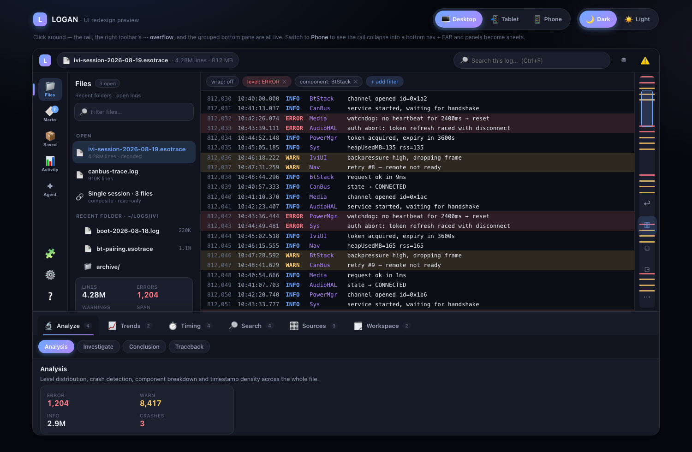
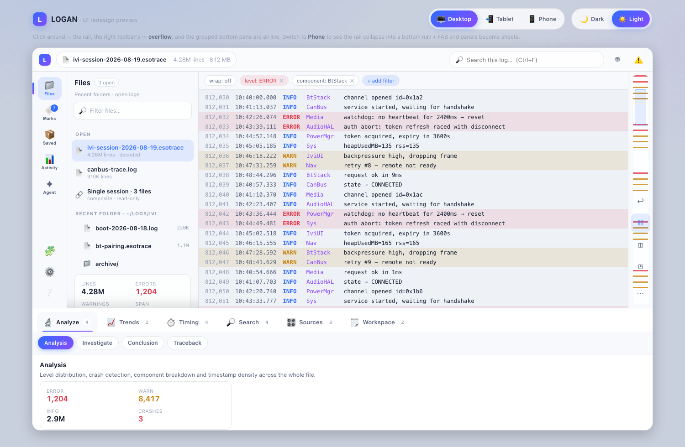
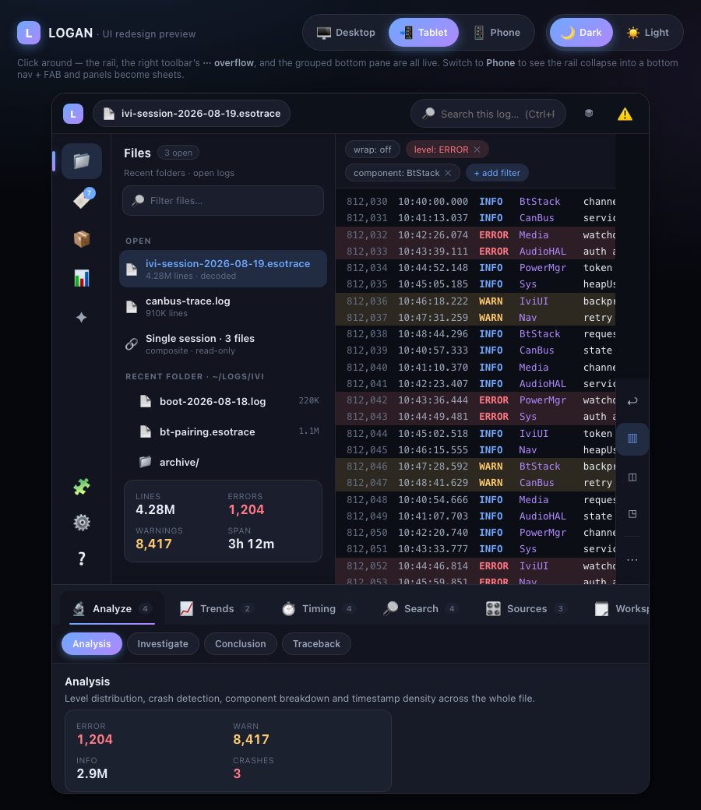
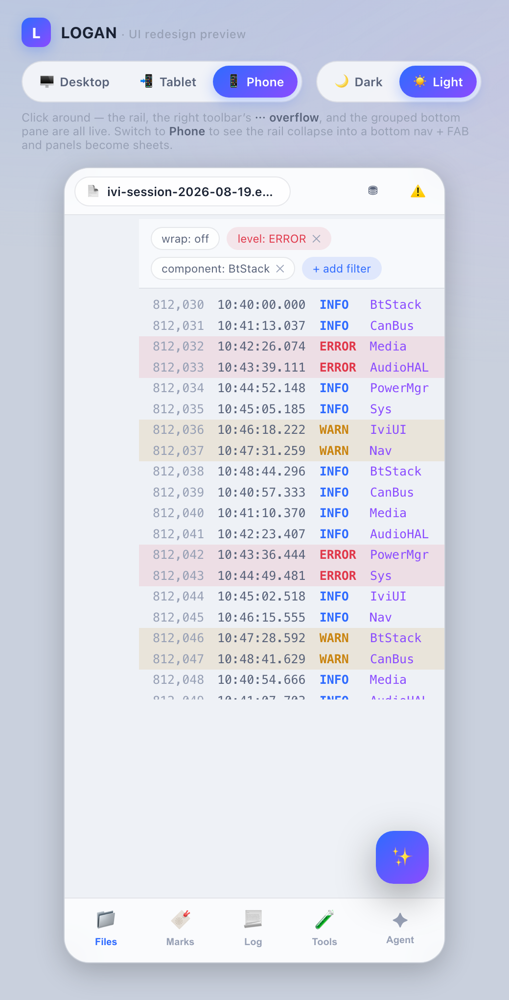

# LOGAN — UI Redesign Preview

A **preview-only** redesign of LOGAN's three chrome surfaces — the left activity
rail, the right view toolbar, and the bottom workbench pane — rebuilt around
*user intent* instead of *feature list*, with a modern, responsive, mobile-trend
look (design tokens, rounded surfaces, frosted top bar, segmented controls,
soft shadows, bottom-sheets on phone).

> This is a **clickable mockup**, not a renderer migration. It exists so we can
> agree on the look and the information architecture *before* touching the
> 25k-line `renderer.ts`. Open `ui-redesign-preview.html` in any browser — no
> build step, no dependencies.

## How to look at it

- **Open the file:** `docs/discovery/ui-redesign-preview.html` (double-click, or
  drag into a browser).
- **Toggles at the top:** switch **Desktop / Tablet / Phone** and **Dark / Light**.
  Everything is live — the rail, the right toolbar's **⋯ overflow**, and the
  grouped bottom pane all respond to clicks.
- **Deep-link a view:** `?device=phone&theme=light&panel=marks` — handy for
  sharing one exact state.

## Screens

| Desktop · Dark | Desktop · Light |
|---|---|
|  |  |

| Tablet · Dark | Phone · Light |
|---|---|
|  |  |

---

## The idea: group by intent, disclose progressively

Today the chrome exposes **~47 top-level controls** at once (15 rail buttons,
12 right-toolbar buttons, 20 bottom tabs). The redesign collapses that to a small
set of *destinations* and *workbenches*, and pushes the long tail into overflow
menus and sub-tab strips — so nothing is lost, but the first screen is calm.

### 1 · Left rail — **15 → 5 destinations + a utility zone**

The rail now answers only one question: *"where do things live?"* The old
mixed bag of panel-togglers **and** bottom-tab shortcuts is separated — bottom
tabs live in the bottom pane, the rail is pure navigation.

| New destination | Folds in the old… |
|---|---|
| 📁 **Files** | Folders + file Stats (as a header card) |
| 🔖 **Marks** | Bookmarks **+** Highlights (both are "things I marked") |
| 📦 **Saved** | Saved entities catalog (unchanged, it was already a catalog) |
| 📊 **Activity** | History **+** AI Annotations **+** analysis counters |
| ✦ **Agent** | Agent Chat, promoted to a first-class persistent panel |

Utility icons (🧩 Features · ⚙️ Settings · ❔ Help) sit pinned at the **bottom of
the rail** — VS-Code style — which also clears them off the right toolbar.

### 2 · Bottom pane — **20 tabs → 6 workbenches** (each with a sub-tab strip)

A two-level model: pick a **workbench group**, then a **sub-tab** inside it.

| Group | Sub-tabs (old tabs) |
|---|---|
| 🔬 **Analyze** | Analysis · Investigate · Conclusion · Traceback |
| 📈 **Trends** | Trends · Signals |
| ⏱️ **Timing** | Time Gaps · Cadence · Time Sync · Time Align |
| 🔎 **Search** | Search Results · Search Configs · Contexts · Column Layouts |
| 🎛️ **Sources** | Live · Video · Image |
| 🗒️ **Workspace** | Notes · Usage |

### 3 · Right toolbar — **12 → 4 view toggles + overflow**

The right edge becomes pure *view control for the current log*:

- **Primary (always visible):** ↩ Word Wrap · ▥ Minimap · ◫ Split · ◳ Overlays
  (Notes / Terminal / Annotations chooser)
- **⋯ Overflow:** Format JSON · Decode esotrace · Columns · Datadog
- **Moved out:** Settings & Help → rail utility zone.

---

## Responsive behaviour (one markup, three shapes)

Driven by **container queries** on the app shell, so the same DOM reflows:

- **Desktop (≥900px):** full rail with labels, side panel, minimap, right toolbar.
- **Tablet (≤900px):** rail drops to icons-only, side panel narrows, minimap hides.
- **Phone (≤520px):** rail becomes a **bottom nav bar** (Files · Marks · Log ·
  Tools · Agent) + a floating **✨ FAB**; side panel and bottom pane become
  **bottom-sheets**; right toolbar collapses into the overflow. Large touch
  targets, rounded sheets, grab-handles.

## Modern styling notes

- CSS custom-property **design tokens** with full dark **and** light palettes.
- Frosted-glass top bar (`backdrop-filter`), pill segmented controls, soft
  layered shadows, spring easing (`cubic-bezier(.22,1,.36,1)`).
- Accent gradient (blue → violet) used sparingly for the active/primary state.
- System font stack; monospace only inside the log viewer.

## Not in scope for this preview

Wiring to real IPC/state, actual data, and the `renderer.ts` migration. If the
look + IA land well, the migration is a mechanical follow-up: the redesign reuses
the existing panels/tabs verbatim — it only **regroups and restyles** them, so no
feature is removed.
